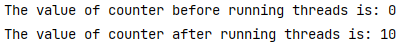

# Binary File I/O and Threads

You are provided a project comprising 2 packages: `binarystreams` and `threads`

## Task a

In the `binarystreams` package, two classes are provided:

- `Species.java` (reduced version of Listing 10.9 in Savitch) 
- `WriteSpeciesFileAppend.java` (a version of Listing 10.10, where a new execution of the program tries to append `Species` to the file). 

Run the `WriteSpeciesFileAppend.java` two times and use the **same file name** both times. The execution of `WriteSpeciesFileAppend.java` will throw an exception when you try to append `Species` objects in the file.

> `Error opening input file : invalid type code: AC`

**Analyze the code and change it so you don’t get the exception.**

***Hint***: *First, check if the file exists. If the file exists, use `writeStreamHeader()` as shown during the lecutre, to reset the header*

*Remember to either delete your previous file or use a new one, when checking your solution. Since the previous one will still give you an error*

## Task b

In the package `threads`, create a task class called `RunnableTask.java` implementing `Runnable`.

- Implement the `Runnable` interface.
- Declare two variables and apply proper encapsulation:
  -  `sum(int)`
  - `threadName(String)`
- Create a one argument constructor: `public RunnableTask(String threadName)`
  - Initialize a variable `sum = 0`.
  - Initialize a variable `threadName` using the `String` passed as an argument.
- Implement `run()` method as follows:
  - Create a for loop that executes 10 times.
  - Add the value of the current iteration, to `sum` in each iteration.
  - Print the `threadName`, and the value *(current value of sum)* such that it looks as follows for the first three iterations of the loop:
    - `Thread: A - Current Value: 0`
    - `Thread: A - Current Value: 1`
    - `Thread: A - Current Value: 3`
  - Finally, after the loop is finished, print the sum from each thread such that it looks as follows: 
    - `Thread: A - Sum: 45`


Add the following to the `main()` method in `RunnableDemo.java`
- Create three task objects. Pass the name of the thread as an argument (Use names A, B, C for each task)
- Create three threads to perform the 3 tasks
- Start/execute the threads
- Examine output: The **last line** for each of the threads should be:
  - `Thread: A - Sum: 45`
  - `Thread: B - Sum: 45`
  - `Thread: C - Sum: 45`

Remember, the order of Thread A, B and C could be different, but the sum for these threads should be **45**.

## Task c

In the package `threads`, create a class `Counter.java`.

- Declare a variable `counter` of type `int`. (remember to apply proper encapsulation)
- Create a Constructor to initialize the variable counter, to be `counter=0;`
- Create a `getCounter()` method for retrieving the value of counter. The method should return the value of the counter.
- Implement an `incrementCounter()` method with the signature `public void incrementCounter()`. The method should increment the value of counter by **2**.
- Implement an `decrementCounter()` method with the signature `public void decrementCounter()`. The method should decrement the value of counter by **1**.


Create a new class, `Task1.java` that extends `Thread`.

- Declare a variable `cr` of type Counter
- Create a 1 argument constructor to initialize the variable `cr`.
- Implement and override the `run()` method, such that it invokes the `incrementCounter()` method 10 times.


Create a new class, `Task2.java`  that extends `Thread`.

- Declare a variable `cr` of type Counter
- Create a 1 argument constructor to initialize the variables `cr`.
- Implement and override the `run()` method, such that it invokes the `decrementCounter()` method 10 times.


Add the following to the `main()` method in `ThreadDemo.java`

- Create an object of class `Counter`

- Print the value of counter by using the `getCounter()` method of the `Counter` class.

  - ```java
    System.out.println("The value of counter before running threads is: " + counter.getCounter());
    ```

- Create an object of class `Task1` (thread class). Pass the `Counter` object as an argument

- Create an object of class `Task2` (thread class). Pass the `Counter` object as an argument

- Start/execute both threads.

- Write the following statement: `Thread.sleep(1000);` (Also handle exception with a `try-catch`)

- Print the value of counter again by using the `getCounter()` method of the Counter class.

  - ```java
    System.out.println("The value of counter after running threads is: " + counter.getCounter());
    ```

- The output should look as follows:


