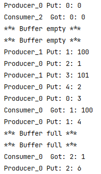

# Callback

We have provided the following classes in the `vop` package:
- `CallBackInterface.java`
- `Dice.java`
- `FacadeWithCallback.java`
- `PrimaryController.java`

This code is supposed to run continually and keep rolling dices, until it lands on two 6's. However it currently doesn't work!
Study the code and implement the tasks below in the `PrimaryController.java` file.

### Task 1

Implement the `buttonAction()` method such that the events from the `startButton`:
- Creates a new instance of `FacadeWithCallBack` and passes the `PrimaryController` (`this`) as a parameter.
- Start the thread of the just created `FacadeWithCallBack` instance.
- Enable the `stopButton`.
- Disable the `startButton`.

### Task 2

Implement the `buttonAction()` method such that the events from the `stopButton`:
- Calls `interrupt()` on the `FacadeWithCallBack` instance.
- Disable the `stopButton`.
- Enable the `startButton`.

### Task 3

Implement the `updateMessage()`:
- It should use `Platform.runLater()` as follows:

```java
Platform.runLater(new Runnable() {
    @Override
    public void run() {
        // code
    }
});
```

- Implement the `run` method, such that it appends the `message` argument into the `textArea`.

  - > Remember to use a `"\n"`, if you want each message on a new line

- The `stopButton` fires, i.e, `stopButton.fire()`, if the `FacadeWithCallBack` thread is not alive.

### Task 4

`updateImages()` is already implemented, but it is commented. Uncomment it and run the code.

# Circular Buffer

The code example shown from [Java Interthread Communication Tutorial 3] shall be changed:

Instead of the class `Q`, you must implement a `CircularBuffer`. The code for `Producer`, `Consumer` and `PCFixed` have been provided in the `circularbuffer` package in this exercise. 
Study the code and complete the following tasks:

### Task 1 - Implementation of CircularBuffer.java

Open the `CircularBuffer.java` and implement the following:

Implement the `put(int n)` method as follows: 

- The `Producers` try to put in values starting at `index = 0`. A value can only be inserted if the place is empty (null). Else it should wait for a `Consumer` to empty the place.

- The value it should put in, should be the argument passed through in the method.

- When a `Producer` has inserted a value on the last place, it should start over and try to insert the next value on `index = 0`.

   - ***Hint:*** *Compute circular index using modulo*

- Notify the other threads, when the producer is done with putting value in the buffer.

- You can use the following print statement inside the put method, to print which place and what value was put in.

   - > `System.out.println(Thread.currentThread().getName()+" Put: " + putIndex+ ": " + n);`

Implement the `get()` method as follows: 

- The `Consumers` takes the values starting on `index = 0`. If there is no value on the place, wait for a `Producer` to put in a value.

- When a value is taken, set the place to `null`.

- When the value on the last place is taken, start at `index = 0`.

    - ***Hint:*** *Again, compute circular index using modulo*

- Notify other threads, when consumer is done with getting value from the buffer.

- You can use the following print statement inside the get method, to print which place and what value was taken.

   - > `System.out.println(Thread.currentThread().getName()+"\tGot: " + getIndex + ": " + buffer[getIndex]);`

### Task 2
Experiment with different numbers of `Producers` and `Consumers` in `PCFixed.java`

### Task 3
Experiment with different sleep-times in `Producer` and `Consumer`


### Example

Below is an example output from running the program:


