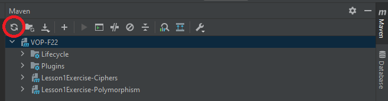
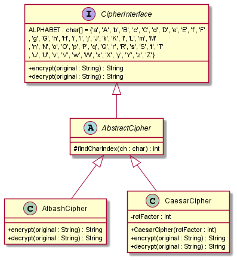
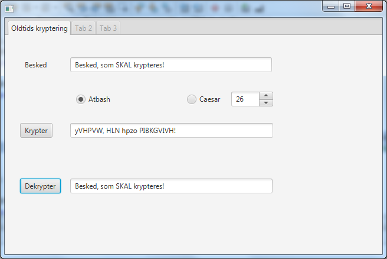

# Ciphers

## Introduction

From VOP F16 Exam - 10. June 2016

**Important**: Sometimes problems can arise when executing the main()-method in the JavaFX project.
Use Shift-F11 eller right click on the project, select Clean and Build, before run is called directly on the Java man.

## Tasks

### Task 1 - Creation of JavaFX Project

**Background**: Create exam-projects that support JavaFX with correct naming conventions. 

1. The project is set up to load JavaFX through Maven. Dependencies need to be loaded before you can run your application - this can be done from the _Maven_ tab in the right side of IntelliJ and then clicking on the reload icon.



2. Start the SceneBuilder by double clikcking the created fxml file (_src/resources/primary.fxml_).

### Task 2 - Implementation of the hierarchy for ancient encryption of texts

**Background**: The need for sending messages which are only readable by the intended recipient of the message, has existed since antiquity. In this assignment you’ll program such an ancient cipher.

- `AtbashCipher`: Originates from around. Year 500 BC, where it was used alongisde the hebraic alphabet. The general idea is that you replace the 1st letter of the alphabet with last, the 2nd letter with the second to last and the 3rd letter with the 3rd to last and so on.

- `CaesarCipher`: Was invented under Julius Caesar (100 BC - 44 BC). The procedure is that all letters in the original message are replaced with a letter that is a given number of places (the key) further down in the alphabet modulus alphabet length.

**Class Diagram**:



**Supplied code**:

- `CipherInterface.java`: The `ALPHABET` constant is an array of chars, consisting of both capitalized and uncapitalized letters from the english alphabet. The array must be percieved as
  circular, meaning that the sequence: ...., 'y', 'Y', 'z', 'Z' is followed by 'a', 'A', 'b', 'B', ..... 2 methods are declared for encrypting and decrypting a String
- `CipherDriver.java`: A class used for testing without a user interface (assignment a, b and c) the 3 upper classed from the diagram must be implemented based on the following requirements (exercise 2a, 2b, 2c and 2d):

### Task 2a - AbstractCipher

Create an _abstract_ class, which implements the `CipherInterface`. The class must **NOT** implement the 2 methods from the interface, but instead contain a method, which the concrete classes can use to locate the index of a given letter in the `ALPHABETH` array. The method must have the following signature:

```java
<accessibility modifier> int findCharIndex(char ch){…}
```

The purpose of the `<accessibility modifier>` is to ensure that the method can only be called from the sub-classes of `AbstractCipher`. The method returns the index, of the ch in the array “ALPHABETH”, or -1, if `ch` doesn’t exist in the array.

### Task 2b - AtbashCipher

This class must inherit __AbstractCipher__. Implement the 2 methods from the interface, like following:

- `public String encrypt(String message)` returns encrypted message, such that every alphabetic character in message is replaced like following: (`’a’` -> `’Z’`, `’A’`-> `’z’`, `’b’` > `’Y’`, and so on.). Remember the non-alphabetic characters, are not changed. This method should first find if the char in the message exists in the ALPHABETH array, if it exists then the char in the message should be replaced by an appropriate char wrt. AtbAsh encryption, otherwise the char should remain unchanged.
- `public String decrypt(String encrypted)` recreates the original message _Hint: Encrypting the encrypted message, with Atbash, is the same as decrypting it._

### Task 2c - CaesarCipher

Must also inherit AbstractCipher.

- The class must have the following attribute: (`int rotFactor`), which consists of the number of places in `ALPHABETH`, that a given character must be rotated (The key).
  - Create a constructor which assigns the rotFactor attribute. Ensure that the integer is neither negative or larger than the number of characters in ALPHABETH.
- `public String encrypt(String message)` returns encrypted message, like following:
  - every alphabetic character in message is replaced by a character, based on the rotFactor.
  - Remember that the `ALPHABETH` has to be considered **CIRCULAR** and that _non-alphabetic_ characters are unchanged. This method should first find if the char in the message exists in the _ALPHABETH_ array, if it exists then the char in the message should be replaced by an appropriate char wrt. `rotFactor`, otherwise the char should remain unchanged.
  - _Hint: The circular index for encryption should be computed like this:
     index = (index + rotFactor) % ALPHABETH.length;_

- `public String decrypt(String encrypted)` must recreate the original message. (it must rotates the opposite direction of the encryption method. 
_Hint: The circular index for decryption should be computed like this:
   index = (index + ALPHABETH.length - rotFactor) % ALPHABETH.length;_


The correct output from running the CipherDriver class is like following: 
```
run-single:
Original:
Her har vi en Meddelelse, som er hemmelig!
Atbash:
sVI SZI ER VM nVWWVOVOHV, HLN VI SVNNVORT!
Her har vi en Meddelelse, som er hemmelig!
Ceasar 13:
oKX NGX BO KT tKJJKRKRYK, YUS KX NKSSKROM!
Her har vi en Meddelelse, som er hemmelig!
BUILD SUCCESSFUL (total time: 0 seconds)
```

### Task 2d - JavaFX



Open the `primary.fxml` file located in resources

A `Label` and `TextField` for the message that should be encrypted.

2 `RadioButtons` for selecting the type of encryption, and a Spinner* for
choosing the `rotFactor` of the `CaesarCipher`.

A `Button` for calling the encrypt method and a `Label` or `TextField` for the encrypted message.
Another `Button` for calling the decrypt method and `Label` or `TextField` for the message.

_Hint: The Spinner can be configured in the controllers initialize()-method with:_
```java
ceasarSpinner.setValueFactory(
    new SpinnerValueFactory.IntegerSpinnerValueFactory(
        0,
        CipherInterface.ALPHABETH.length - 1,
        CipherInterface.ALPHABETH.length / 2
    )
);
```

_Alternatively_ you can use a `TextField`. In that case the input must be converted to a `int`.

The 2 `Buttons` must have a common `actionHandler`, checking which of the 2 `RadioButtons` is selected, and then initializing a local variable of the type `CiperInterface` as either `AtbashCipher` or `CaesarCiper` (with the value of the Spinner) and afterwards calling either `encrypt()` with the original message in the message field or `decrypt()` with the encrypted text from the field.

