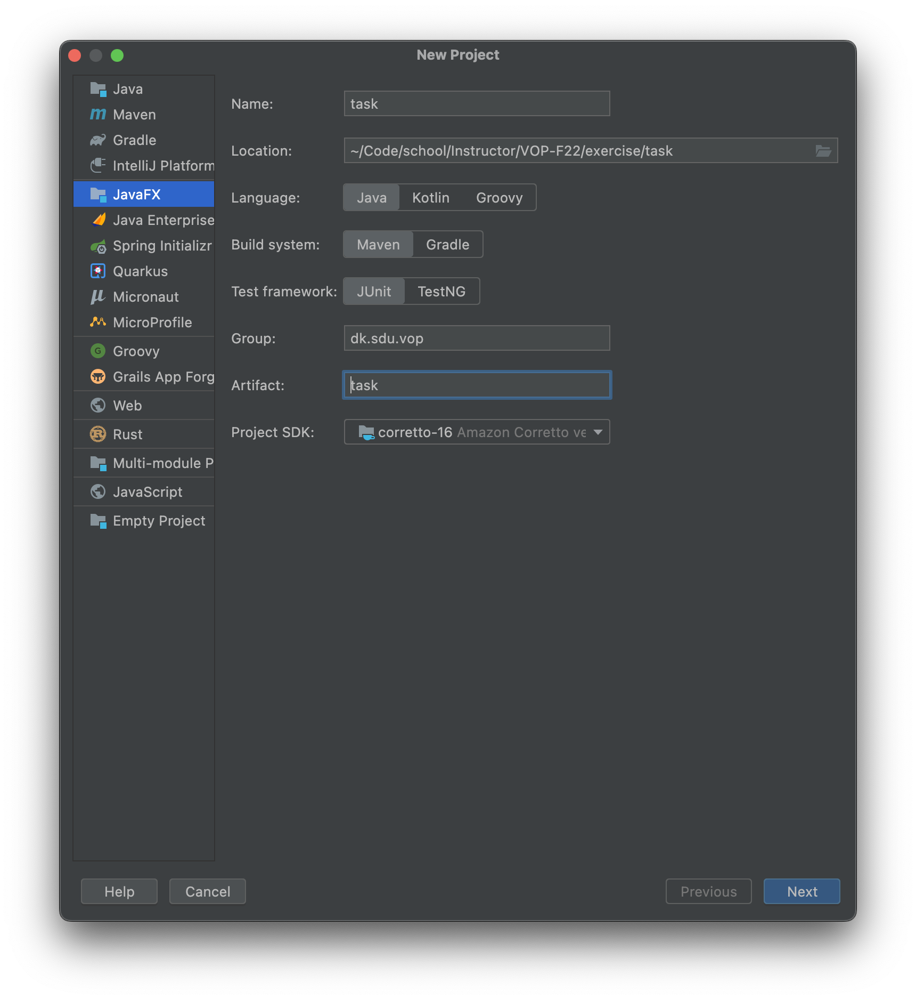
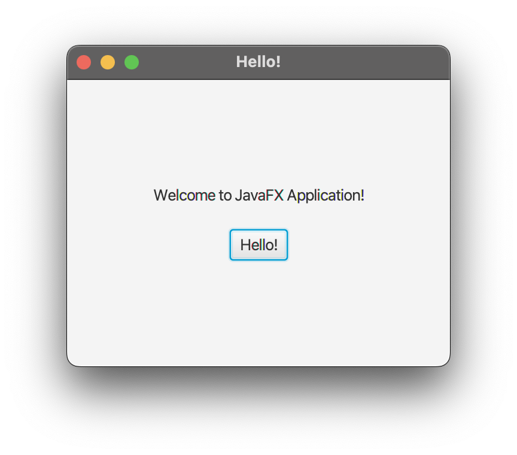
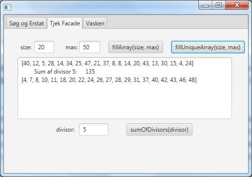
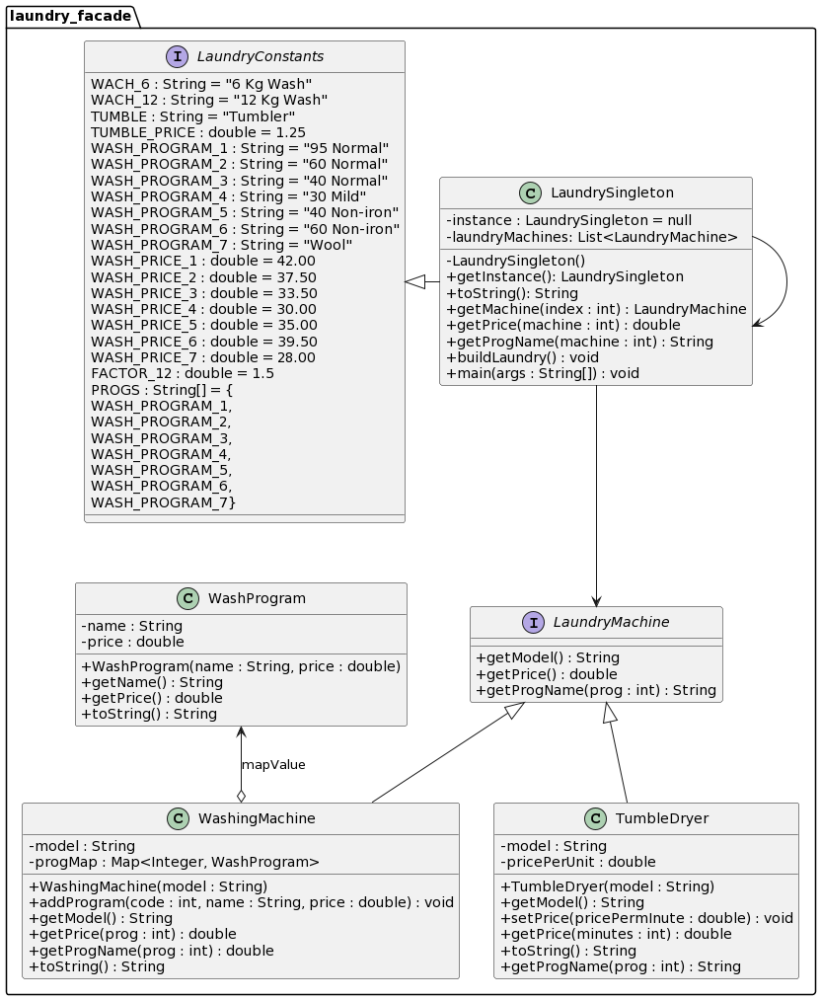
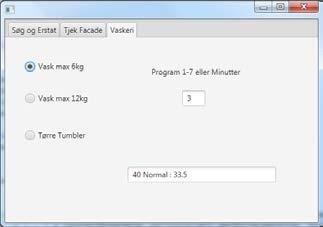
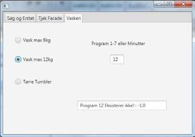

# Exercises for Lecture 12

## Task 1 - JavaFX Settings

__Purpose__: To create an exam project as a JavaFX project, correctly named and prepared for the following tasks.

Open IntelliJ and select the JavaFX tab.

Use the following parameters:

- Language: **Java**
- Build system: **Maven**
- Test framework: **JUnit**
- Project SDK: **Your newest one (18-19-20 will be good)**

The additional settings are up to yourself.



When pressing next you will be presented with different dependencies -

### __none are neeeded__.

Press **finish**.

This will initialize the project, verify that everything is working by opening the _"HelloApplication.java" file and
starting the main method. This should prompt the following window: 

You are now ready to continue with the following exercises😁.

## Task 2 - Facade-pattern and some basic Java

**Purpose**: To implement a Facade-pattern class, that the GUI layer is able to utilize.

1. Implement a class `Facade.java` in the package _boilerplate_
2. Create a private variable `int[] intArray` within the class
3. Create a private variable of type `java.util.Random`
4. Initialize the Random-generator in the constructor
5. Create a ”getter()”-method, that returns `intArray;`

_In the following three subtasks, you'll program three algorithms that utilizes arrays, loops and conditionals._

### Task 2.1 - public int[] fillArray(int size,int max)

Implement the method, so it initializes `intArray` to the size of `size` and fills it with random numbers in the
interval `[0..max]`. The array is then returned.

### Task 2.2 - public int sumOfDivisors(int divisor)

Implement the method, so it returns the sum of the numbers within the `intArray` variable that is divisible by
the `divisor` argument (`x % divisor == 0`).

### Task 2.3 - public int[] fillUniqueArray(int size, int max)

Implement the method, so it initializes `intArray` to the size of the argument `size` and fills it with random unique
numbers within the `[0..max]` interval. Ensure that `size < max` and no numbers are repeated.

_Hint: define a private method, that verifies if the numbers from the random-generator exists in the array, before
inserting it.

Before the array is returned, it's a good idea to sort it using `Arrays.sort()`, as it makes it much easier to spot if
the numbers truly are unique.

Example: Execution of your `main()`-method could give the following:

```
fillArray: [0, 4, 5, 5, 4, 5, 1, 5, 6, 2, 7, 5, 4, 2, 1, 8, 1, 4, 9, 8] Divisors of 3 has Sum: 15
fillUnique: [1, 2, 3, 4, 6, 7, 8, 9, 10, 13, 16, 17, 18, 20, 21, 23, 24, 26, 27, 28] size er larger than max!
Error: null
```

### Task 2.4 - Calling methods from the GUI layer

Create a new tab panel within your JavaFX application and name it ”_Verify Facade_”.

Declare the facade as a variable and initialize i within the `initialize()` method in the accompanying controller.

Create components within the tab, such that the three methods in the Facade class can be called from the UI. You can use
the following UI as reference:



## Task 3 - Polymorphism and a facade that uses the singleton-pattern

This class diagram shows a simplified structure of a laundro mat:



The interface `LaundryMachine` represents all machines, that can be used inside a laundromat (wash, drying, spin drying,
soap-vendor, coffee machine and more.). However, in this task we're solely focusing on washing machines and dryers:

`LaundryMachine.java` (supplied boilerplate code) defines the methods:

| Method                            | Return                                              |
|-----------------------------------|-----------------------------------------------------|
| `String getModel()`               | Returns the model of the machine                    |
| `double getPrice(int program)`    | Returns the price when using the machine            |
| `String getProgName(int program)` | Returns a description of a program that can be used |

`TumbleDryer.java` represents dryers:

- Implements the interface `LaundryMachine` in the class (Hint: how do we normally implement interfaces?)
- The constructor takes a `model` as an argument

| Method                                 | Info                                                       |
|----------------------------------------|------------------------------------------------------------|
| `void setPrice(double pricePerMinute)` | Sets the minut price when using the machine                |
| `double getPrice(int program)`         | Returns the price of a given program.                      |
| `String getProgName(int program)`      | Returns for example "Drying for 30 minutes", if prog = 30. |

`WashingMachine.java` represents washing machines:

- implements the `LaundryMachine` interface
- the constructor takes a model description as an argument
- contains an attribute of the type`Map<Integer, WashProgram>`:
  _Contains the programs that are available_.

| Method                                                 | Info                                                                  |
|--------------------------------------------------------|-----------------------------------------------------------------------|
| `void addProgram(int prog, String name, double price)` | Defines a washing program and puts it into the map with `prog` as key |
| `double getPrice(int program)`                         | Returns the price of use of program `program`                         |
| `String getProgName(int program)`                      | Returns the name of the program `prog`                                |

`WashProgram.java` (supplied code) represents a single wash program including its name and price.

`LaundryConstants.java` (supplied code) is an interface containing model definitions, program names, program prices and
an array of program-names. These constants can be used to create a test laundro mat, and also used within the user
interface in task 3.2.

`LaundrySingleton.java` represents a test laundromat, which partially can be run through the `main()` method and can be
partially used as a _Facade_ within the JavaFX GUI. Only the part that makes this class a singleton isn't implemented.

It contains a method `public void buildLaundry()`, that creates a laundromat with the values from `LaundryConstants`.

### Task 3.1 - Singleton

__Purpose__: To implement a class, which uses the singleton pattern.

Create code within the `LaundrySingleton.java`, such that it becomes a singleton class. The singleton pattern dictates
that instance methods only are available through a static method, such as the
`public static LaundrySingleton getInstance();` and that whenever you interact with the class, it is through the same
instance every time

### Task 3.2 - Implementations of the LaundryMachine interface

__Purpose__: Implementation of polymorphism methods defined within the interface.

Implement the missing code in:

- `TumbleDryer.java`
- `WashingMachine.java`

When executing the `main()`-method within `LaundrySingleton`, the output should look like so:

```
Washing machine max 6 kg:
40 Iron-free        35,00

Washing machine max 12 kg: 
40 Iron-free        52,50

Drying Machine:
Drying for 5 minutter 6,25
```

### Task 3.3 - GUI

__Purpose__: Implementation of a simple user interface that uses the `LaundrySinleton` class to make polymorphism calls
to the `LaundryMachine` interface implementations.

Create a new `Tab` within your user interface named ”_Laundromat_”.

From the UI, it should be possible to test the laundro mat. For each of the three machines, generated by
the `LaundrySingleton.buildLaundry()`, it should be possible to select a program (and pick minutes for the dryer) and
get a price quote:

- Add the line `LaundrySingleton.getInstance().buildLaundry()`; to the `initialize()`-method within your JavaFX
  controller such that the test laundro mat is available.
- The test user interface contains the following:
    - Three `RadioButton`s sharing a common `ToggleGroup`, that lets the user pick a washing machine.
    - A `Label` and an accompanying `TextField` allowing the user to enter the program number or the drying time.
    - A `Textfield` that shows the selected program and price.
    - When a washing machine is selected, use the program name and the price mthods defined in `LaundrySingleton`.

The following three examples that shows a possible solution to the UI (in the last example the value -1.0 is used as an
error code when a program is missing ):


> Program 3 selected on machine 0.


> 12 minutes of drying selected on machine 2.


> Non-existent program selected on machine 1.