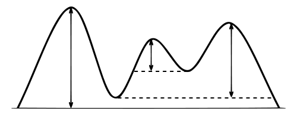

# Mountains

## Tasks

*FrenchMountains.csv* is a semicolon-separated text file, where each line provides information about the mountains in France that have a *topographic prominence* taller than 1000 meters (*topographic prominence* is the relative height of a mountain top, see the figure, from *en.wikipedia.org*): 

In the file a Mountain is described with:

- `name` - The mountain’s name
- `height` - Height above the sea level
- `prominence` - Relative height (fig. 1)
- `latitude` - Latitude in Degree°Minutes’Seconds”
- `longitude` - Longitude in Degree°Minutes’Seconds”
- `range` - The mountain range

As an example, here is the line for *Mount Ventoux*:
> Mont Ventoux;1909;1148;44°10'26";05°16'42";Alps

In this task, the file must be read, and the information inserted into a data structure. The supplied code contains a `main()`-method that can be used to test the class.

### Example



- Vertical arrows show the topographic prominence of three peaks on an island. 
- The dashed horizontal lines show the lowest contours that do not encircle higher peaks.

### Task a - Creation of the Mountain Class

- Create a class with the signature `public class Mountain implements Comparable`
- Declare 6 instance variables to store the information about Mountain.
- Create a constructor to initialise these variables
- Override `public String toString()` **such that running the** `main()` **method gives the following output:** 
  Please uncomment the code in `main()` method for Task a

> Mont Ventoux h=1909, pro=1148, lat=44°10'26", lon=05°16'42", ran=Alps

### Task b - compareTo()-method

- Implement the `public int compareTo(Mountain o)`, such that instances of `Mountain`, can be sorted by `prominence`. If several mountaintops have the same `prominence`, these should be sorted by `height`.
- Uncomment the code in the `main()`-method for Task b, the output should look as following:

```
Unsorted: 
[Pic du Midi d'Ossau h=2886, pro=1092, lat=42°48'22", lon=-00°25'05", ran=Pyrenees
, Pica d'Estats h=3143, pro=1281, lat=42°42'43", lon=00°57'23", ran=Pyrenees
, Pic de Bure h=2709, pro=1268, lat=44°37'38", lon=05°56'07", ran=Alps
, Mont Chaberton h=3131, pro=1281, lat=44°57'53", lon=06°45'06", ran=Alps
]

Sorted: 
[Pic du Midi d'Ossau h=2886, pro=1092, lat=42°48'22", lon=-00°25'05", ran=Pyrenees
, Pic de Bure h=2709, pro=1268, lat=44°37'38", lon=05°56'07", ran=Alps
, Mont Chaberton h=3131, pro=1281, lat=44°57'53", lon=06°45'06", ran=Alps
, Pica d'Estats h=3143, pro=1281, lat=42°42'43", lon=00°57'23", ran=Pyrenees
]
```

### Task c - Reading mountains from text file

Implement a java main class with the signature `public class MountainSet`

The class must include:

- Declare an instance variable of type `Set<Mountain>` with a name **tree**
- A constructor that instantiates the data structure so that it is always sorted using the `compareTo()` method in the `Mountain` class.  ***(Hint: Use TreeSet<>())***
- A `get()` method, which returns the set.
- A `public static void main (String [] args)`-method, in which
  - Declare and instantiate an instance of `MountainSet` "`mSet`"
  - *Read FrenchMountains.csv* such that one line is read at a time
  - Create an instance of `Mountain` for each line read from FrenchMountain.csv, and insert the `Mountain` instance in the set using `add(Mountain m)`
  - Print the set finally, using `System.out`.
  - Remember to handle exceptions

The first 7 lines of the print, should look like this:

```
[Puig Carlitte h=2921, pro=1001, lat=42°33'39", lon=01°48'37", ran=Pyrenees 
, Soularac h=2368, pro=1007, lat=42°45'58", lon=01°51'05", ran=Pyrenees 
, Pic de Rochebrune h=3320, pro=1019, lat=44°49'21", lon=06°47'16", ran=Alps 
, Le Tabor h=2389, pro=1022, lat=44°58'39", lon=05°51'21", ran=Alps 
, Vignemale h=3298, pro=1025, lat=42°42'16, lon=-00°03'50", ran=Pyrenees 
, Le Roignais h=2995, pro=1028, lat=45°38'35", lon=06°41'20", ran=Alps 
, Montagne de Céüse h=2016, pro=1040, lat=44°30'32", lon=05°57'43", ran=Alps]
```

### Task d - Sorted Set with Comparator

- Create a class with the signature:

  `public class MountainRangeComparator implements Comparator<Mountain>` 


- Implement the `compare()` method to compare two `Mountain` objects by their range values and if the two objects have the same range, they should be compared by their prominence values and if the two objects have the same prominence, they should be compared by their height values. (**hint**: use `compareTo()`-method in Mountain. *Remember* *to add a* `public int getRange()` *method to the* `Mountain` *class, to be used in the `compare()` method)*


- Add the following method to the MountainSet class: 

  `public set <Mountain> sortByRange (Comparator comp)`

  1. Create an instance of `TreeSet` and pass `Comparator` object as an argument in its contructor, i.e., `Set<Mountain> rangeTree = new TreeSet<>(comp);`
  2. Add `MountainSet tree` to the set created above, i.e., `rangeTree.addAll(tree)`;
  3. Return a `Set "rangeTree"` which is sorted by an instance of `MountainRangeComparator`.
  4. Add the following lines in the `main()` method  of the `MountainSet` class and run

```java
System.out.println("Sorted by range:");
System.out.println(mSet.sortByRange(new MountainRangeComparator()));
```

 

You should get the following output

```
Sorted by range:
[Pic de Rochebrune h=3320, pro=1019, lat=44°49'21", lon=06°47'16", ran=Alps 
, Le Tabor h=2389, pro=1022, lat=44°58'39", lon=05°51'21", ran=Alps 
, Le Roignais h=2995, pro=1028, lat=45°38'35", lon=06°41'20", ran=Alps 
, Montagne de Céüse h=2016, pro=1040, lat=44°30'32", lon=05°57'43", ran=Alps 
, Grand Pic de Belledonne h=2978, pro=1054, lat=45°10'09", lon=05°59'22", ran=Alps  

- - - etc. - - - 
```

And end with the remaining mountain ranges:

```
- - - etc. - - - 
 
, Crêt de la Neige h=1720, pro=1267, lat=46°16'49", lon=05°57'16", ran=Jura 
, Puy de Sancy h=1885, pro=1575, lat=45°31'42", lon=02°48'51", ran=Massif Central 
, Puig Carlitte h=2921, pro=1001, lat=42°33'39", lon=01°48'37", ran=Pyrenees 
, Soularac h=2368, pro=1007, lat=42°45'58", lon=01°51'05", ran=Pyrenees 
, Vignemale h=3298, pro=1025, lat=42°42'16, lon=-00°03'50", ran=Pyrenees 
, Pic du Midi d'Ossau h=2886, pro=1092, lat=42°48'22", lon=-00°25'05", ran=Pyrenees 
, Pica d'Estats h=3143, pro=1281, lat=42°42'43", lon=00°57'23", ran=Pyrenees 
, Puigmal h=2909, pro=1331, lat=42°29'47", lon=02°05'37", ran=Pyrenees 
, Grand Ballon h=1424, pro=1072, lat=47°54'04", lon=07°05'53", ran=Vosges 
] 
```
