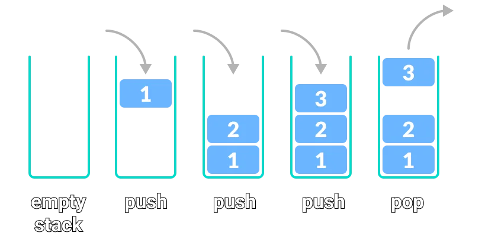

# Matching Brackets

## Tasks

In this exercise you are tasked within creating a program that can evaluate whether there is a balance within a string
of brackets. An example of this is `[{}]` where there are equally many opening brackets as there are closing.
`[{()]` is an example of no balance between the brackets as we are missing one.

### Task 1

Implement the `checkBrackets` method.

To see whether an expression of the form “`–{ [b ⋅ b – (4 ⋅ a ⋅ c ) ] / (2 ⋅ a) }`” is correctly formed, place the
parentheses onto a `Stack<Character>`:

- When you see an opening parenthesis, push it on the stack.
- When you see a closing parenthesis, pop the stack.
  - If the opening and closing parentheses don’t match - the parentheses are unbalanced.
  - If at the end the stack is empty - the parentheses are balanced.

`Hint: consider using some smart way of switching the known brackets`

### Task 2

- Use a `List<Character>` instead of a `Stack` - remember that values should be inserted and retrieved in a **LIFO** (Last In, First Out) manner. 
    - You are free to create a new class for this purpose, if you don't want to overwrite the existing one. In this class you need to implement another `checkBrackets`-method.

`Hint: when adding to a specific index in a list, you push aside what is already there`

### Bonus Task
For an added challenge:
- The main method should now take a file as an input, instead of input from the keyboard.
