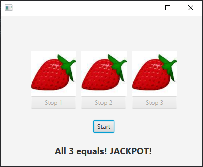
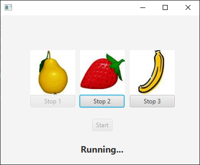
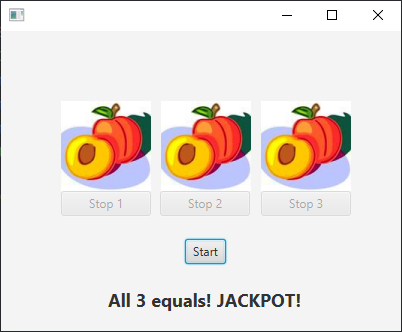

# One Armed Bandit

The term "one-armed bandit" is slang for the old-fashioned machines, where you could stand for hours, stuffing money in with one hand and pulling a handle with the other. In this task, such a bandit will be implemented, but without the betting and winning part. A possible layout is shown below:

The system consists of:
- 3  `ImageViews` for changing sequences of images.
- 3 `Buttons` to stop the sequences individually.
- 1 start `Button`, which starts the sequences in all 3 image fields.
- 1 `Label`, which shows the result after all 3 sequences are finished

**The easiest choice would be to use an implementation of javafx.animation.AnimationTimer, but that is forbidden in this task, as it is Threads in the context of JavaFX that we are training.**

Resource files: contains 10 images of fruit. The images are 90*90 pixels.

## Task 1
Define the user interface of the application. It is recommended to use SceneBuilder.
- Create 3 `ImageViews`
  - Name them `spin1`, `spin2`, `spin3`.
- Create 3 `Buttons `to stop the image sequence in each `ImageView`
- Create 1`Button` to start the image sequences in all `ImageViews`
  - Name it `startButton`.
- Create a `Label` to display the result after all the image sequences are finished.
  - Name it `resultLabel`.

In the `PrimaryController`:

- Declare an Array of type `Image`, as a `javafx.scene.image.Image`, as follows `Image[] images`
- Declare 3 variables of type `Thread` as follows: `Thread t1, t2, t3;`:
- Declare a variable `spinsALive` of type `int`

Implement the `initialize()` method:
- Initialize the array declared earlier. The size of the array should be 10, as follows: `images= new Image[10]`;
- Use a for loop and load the 10 supplied images into this array. 
- Each image can be inserted into the array with the following statement `images[i]=new Image(getClass().getResource(filename).toURI().toString());`
  - ***Hint:*** *Remember to declare the filename, which is always "fruits" + some number + ".png"*
  - (Remember to catch relevant exceptions, using a  `try-catch`)
- Outside the for loop, set any 3 images in the 3 `ImageViews` as follows: `spin1.setImage(images[1])`;
- Disable the three stop buttons.
  - ***Hint:*** *You can use the `setDisable()` method*

## Task 2
- A synchronized method `aliveCount` is already implemented. but it is commented. Uncomment it and study the code.

- An inner class `public class BanditRunnable implements Runnable` is already implemented, but it is commented. Uncomment it and study the code

Create an `ActionHandler` for the Start button:
- Create 3 instances of `BanditRunnable`. The constructor takes 3 arguments. Pass the appropriate arguments for each instance. (Remember to use all 3 `ImageViews`)
  ***Hint:*** *Different waiting times must be inserted in the three Threads between each image switch. For example 120, 100 and 140 milliseconds*
- Initialize the 3 threads you created earlier and pass each thread a different instance of `BanditRunnable`.
- Set each thread as a Daemon thread as follows: `t1.setDaemon(true)`.
- Start/execute each thread.
- Disable the Start button.
- Enable Stop buttons for each `ImageView`.
- Change the label to `"Running..."`

Create an `ActionHandler` for the Stop buttons:
- Each button stops one sequence (e.g. with an interrupt of the corresponding Thread).
- And disable the stop button which called the `ActionHandler`. 
  - *i.e. if the 2nd button called the ``ActionHandler`, the 2nd `ImageView` should be stopped (by interrupting the thread) and the 2nd button should be disabled*.

In the same `ActionHandler`, when all 3 Threads are stopped:
- Enable the Start button.

***Hint:*** *You can use `event.getSource()`, to determine which button called the `ActionHandler`*

For reference here is an example of how the UI could look while running:

For reference here is an example of how the UI could look for all 3 results:

