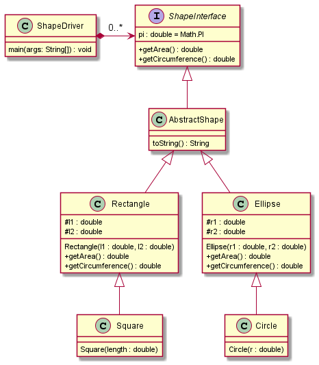
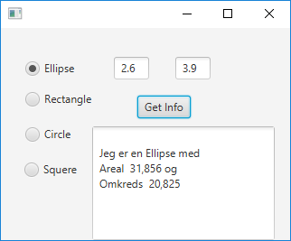
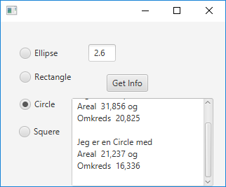

# Polymorphism

## Tasks - Inheritance, Interface og Polymorphism

Your assignment is to implement the following class diagram:



Supplied code:
- ShapeInterface.java
- AbstractShape.java
- ShapeDriver.java


### Task a - Ellipse and Rectangle

1. Create a subclass `Ellipse.java` as follows: `public class Ellipse extends AbstractShape`
2. Declare 2 instance variables of type `double`
3. Create a constructor to initialise these variables
4. Implement methods `getArea()` and `getCircumference()` using the formula below.
   
Similarly do it for Rectangle as well.

5. Create a subclass `Rectangle.java` as follows: `public class Rectangle extends AbstractShape`
6. Declare 2 instance variables of type `double`
7. Create a constructor to initialise these variables
8. Implement methods `getArea()` and `getCircumference()` using the formula below.

The following formulas can be used to calculate `getArea()` and `getCircumference()`:

|               | Ellipse                                            | Rectangle       |
|---------------| -------------------------------------------------- |-----------------|
| Area          | _π * r1 * r2_                                      | _l1 * l2_       |
| Circumference | _2 * π * √(½ * (r1<sup>2</sup> + r2<sup>2</sup>))_ | _2 * (l1 + l2)_ |

### Task b - Circle and Square

Create a subclass Circle.java as follows: `public class Circle extends Ellipse`
Create a subclass Square.java as follows: `public class Square extends Rectangle`

Remember that circles and squares are just ellipses and rectangles with r1=r2 and l1=l2 respectively

When `ShapeDriver` is executed the output must look like the following:
```
Shapes: [
Jeg er en Circle med Areal 36,317 og Omkreds 21,363,
Jeg er en Rectangle med Areal 14,960 og Omkreds 15,600,
Jeg er en Ellipse med Areal 28,840 og Omkreds 19,289,
Jeg er en Square med Areal 11,560 og Omkreds 13,600]
```

### Task c (ekstra) - GUI and Singleton Facade
In this task, you’ll work with the following class:
- ShapeFacade.java

This is the only class we will access from the GUI. The Singleton pattern is a design pattern, ensuring only 1
instance of the class exists. This instance can be accessed through the `getInstance()`-method.

To distinguish between the 4 concrete instances of Shapes, the class contains the following enum:
```java
public enum SHAPES {
    CIRCLE, ELLIPSE, RECTANGLE, SQUARE
};
```

`SHAPES`  can be accessed statically through other classes (example: `ShapeFacade.SHAPES.CIRCLE`).

### Task d - getShapeInfo() method

Implement the following method depending on the shape it recieves, it should take either 1 or 2
parameters of the double type, as follows
```java
public String getShapeInfo(SHAPES shape, double... parametre) {
    throw new UnsupportedOperationException("Not supported yet.");
}
```

- Create a switch depending on the type of shape: `Circle`, `Square`, `Ellipse`, `Rectangle`.
- These shapes should then be created with the parameters the method receives.
- If the case is either `Circle` or `Square`, it should take the 1st double param passed to the method to construct the shape.
- If the case is `Ellipse` or `Rectangle`, it should take the 1st and 2nd double param passed to the method to construct the shape.

### Task e - Implement the GUI
In your resources folder locate the FXML file.
The final GUI is supposed to look like the following screenshots:




It consists of:
- __4__ `RadioButtons` for choosing the Shape.
- __2__ `TextFields` TextFields for params. Only one is visible if Circle or Square has been selected.
- __1__ `TextArea` for results.
- __1__ `Button` "Get Info" for calling the facade.


Implement an `ActionHandler` for the 4 `RadioButtons`, to ensure one or both `TextFields` are visible.

*Hint: in the `initialize()`-method of the Controller the radiobuttons have been given userData with the enum-values from the Facade. i.e. 
`ellipseRadio.setUserData(ShapeFacade.SHAPES.ELLIPSE);`\
These can be accessed with:
`ShapeFacade.SHAPES shape = (ShapeFacade.SHAPES)ShapeToggle.getSelectedToggle().getUserData();`\
Remember to uncomment the code and to name the radiobuttons accordingly.*

If the Shape is  Circle or Square, then 1 TextField should be visible and if the shape is Ellipse or Rectangle, 2 TextFields should be visible.

Implement a `ActionHandler` on the Get Info-button, so that the facade is called by:

- `ShapeFacade.getInstance().getShapeInfo(shape, new double[]{p1});` (Circle/Square) or
- `ShapeFacade.getInstance().getShapeInfo(shape, new double[]{p1, p2});` (Ellipse/Rectangle) 

The result is then printed out in the TextArea.
