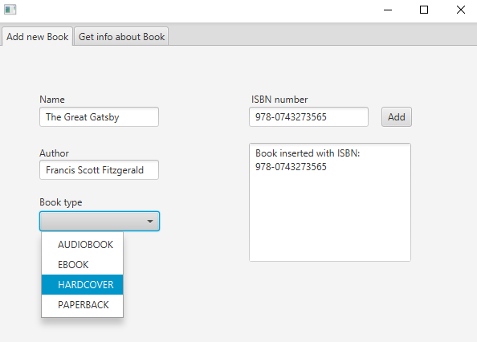
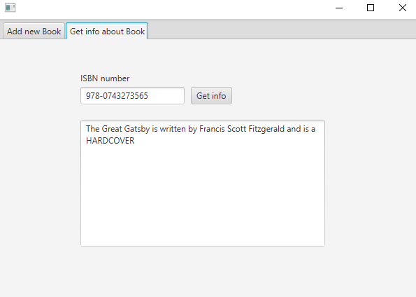

# Practice Assignment 3

## Tasks - Collections Framework & JavaFX
Assume, you are a Software Engineering/Software Technology student. In the Advanced Object-Oriented Programming course, you are asked to model and implement a Book, which is characterised by different properties. You are also asked to create a GUI, which is used to insert/retrieve book information for later use.

Supplied Code: 

- Book.java
- BookType.java

`BookType.java` is an Enum containing 4 different book types:

- Audiobook, eBook, Hardcover & Paperback

## Task 1 - Creating the Book Class

1. In the `Book.java` class declare the following variables:

   - `String name`

   - `String author`

   - `BookType bookType`

     *(Remember to apply encapsulation)*

2. Create a constructor to initialize these variables.

3. Override the `toString()` method such that the output looks as following:

> The Great Gatsby is written by Francis Scott Fitzgerald and is a HARDCOVER

To test the `toString()` method you can uncomment the code in the `main()` method of `Book`.

## Task 2 - Creating a HashMap

1. In the `PrimaryController.java` declare a `HashMap` to hold a reference between a Book and its ISBN.
   1. *(ISBN stands for "International Standard Book Number". It is a unique identifier that every book has. E.g. **978-0743273565**)*
2. Initialize the `HashMap` in the `initialize()`method.

*Hint: (Use `HashMap<String, Book>`)*

## Task 3 - JavaFX

Open the `primary.fxml`file located in resources.

In the first tab create the following elements:

- 4 `Labels`, one for each of the inputs (i.e. name, author, book type & ISBN)
- 3 `TextField`, one for the name, one for the author and one for the ISBN
- A `ChoiceBox` for picking the book type
- A `TextArea` to display the newly added ISBN
- A `Button` for calling the method to add a new Book to the `HashMap`

*Hint: When declaring the `Choicebox`, use the type `BookType` (`ChoiceBox<BookType>`)*

In the second tab create the following elements:

- A `Label` and `TextField` for the ISBN that should be looked up
- A `TextArea` to display the information about the Book
- A `Button` for calling the method to get a Book from the `HashMap`

## Task 4 - Implementing the functionality

Open the `PrimaryController.java`file.

1. In the `initialize()` method fill the `ChoiceBox` with the elements from `BookType`.

   *Hint: Use* `.getItems().addAll(BookType.values())` *on the declared `ChoiceBox` variable to add all elements from `BookType`*

2. Implement a method/ActionHandler on the `Add`-button such that:

   - A new Book is created from the `Name`, `Author` and `BookType` fields.

   - The new Book is added to the `HashMap` using the ISBN as a key.

   - The ISBN is printed out in the `TextArea` below.

     *(Remember to check if all fields are valid, before adding a new Book to the `HashMap` )*

3. Implement a method/ActionHandler on the `Get info`-button that:

   - Looks up the ISBN in the `HashMap` and retrieves the Book.
   - If the ISBN is found, it prints out the information about the Book in the `TextArea` below.
