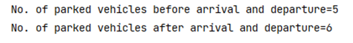

# Practice Assignment 4

This task is based on multithreading and thread synchronization. Consider a scenario of a vehicle counting system which counts the number of cars entering the SDU parking area. Assuming there are enough parking slots available in the parking area, two vehicles enter the parking area, whereas one vehicle leaves the parking area. All vehicles' arrival and departure can be considered as threads, and the vehicle counting system can be considered as a single object, which is modified by these threads. In this task, you need to avoid race condition, such that when one thread is accessing the state of the object, another thread will wait to access the same object at a time until their turn comes.

In this task, we have provided 2 classes called `ThreadDemo.java` and `VehicleCounting.java` in the package `multithreading`.

## Task 1:

Complete the implementation of `VehicleCounting.java` 
*(Remember to use the correct access modifiers for variables, constructor and methods).*

- Declare a variable `counter` of type `int`.
- Create a one argument constructor to initialize the variable `counter`.
- Create a `getCounter()` method for retrieving the value of variable. The method should return the value of the variable.

- Implement `incrementCounter()` method with the signature `void incrementCounter()`
    
    - Increment the variable `counter` by 1.
    
      *(**Hint** : You will need to use some form of implicit/explicit thread synchronization to avoid race condition).*
    
- Implement `decrementCounter()` method with the signature `void decrementCounter()`

    - Decrement the variable `counter` by 1.

      *(**Hint** : You will need to use some form of implicit/explicit thread synchronization to avoid race condition).*

## Task 2:

- Create a class `ArrivalTask.java` with the signature `public class ArrivalTask implements Runnable` in the *multithreading* package.
- Declare a variable `vc` of type `VehicleCounting`.
- Create a one argument constructor to initialize the variable `vc`
- Implement the `run()` method such that it invokes the `incrementCounter()` method of `VehicleCounting`.

## Task 3:

- Create a class `DepartureTask.java` with the signature `public class DepartureTask implements Runnable` in the *multithreading* package.
- Declare a variable `vc` of type `VehicleCounting`.
- Create a one argument constructor to initialize the variable `vc`
- Implement the `run()` method such that it invokes the `decrementCounter()` method of `VehicleCounting`.

## Task 4:

Time to make sure it all works! A `main()` method is already implemented in `ThreadDemo.java` but the lines of code in the method are commented out. 

- Uncomment the code to test your implementation.

**Example** of correct output

