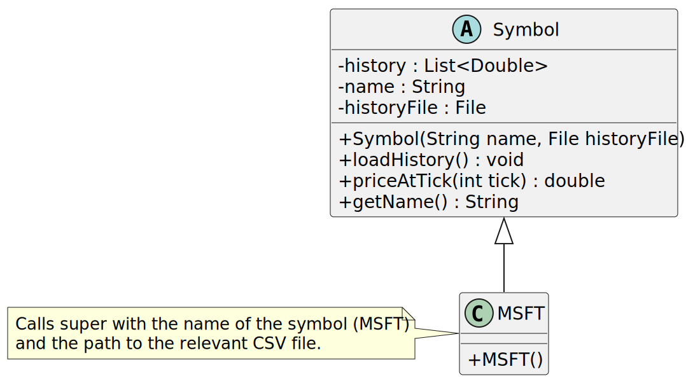
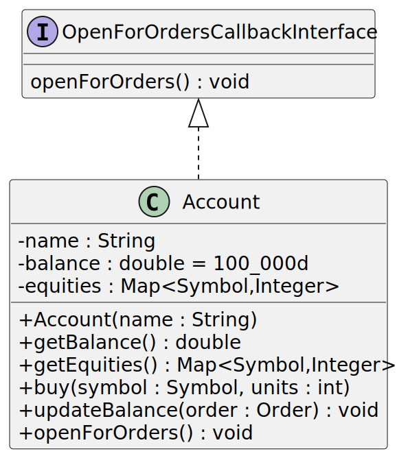
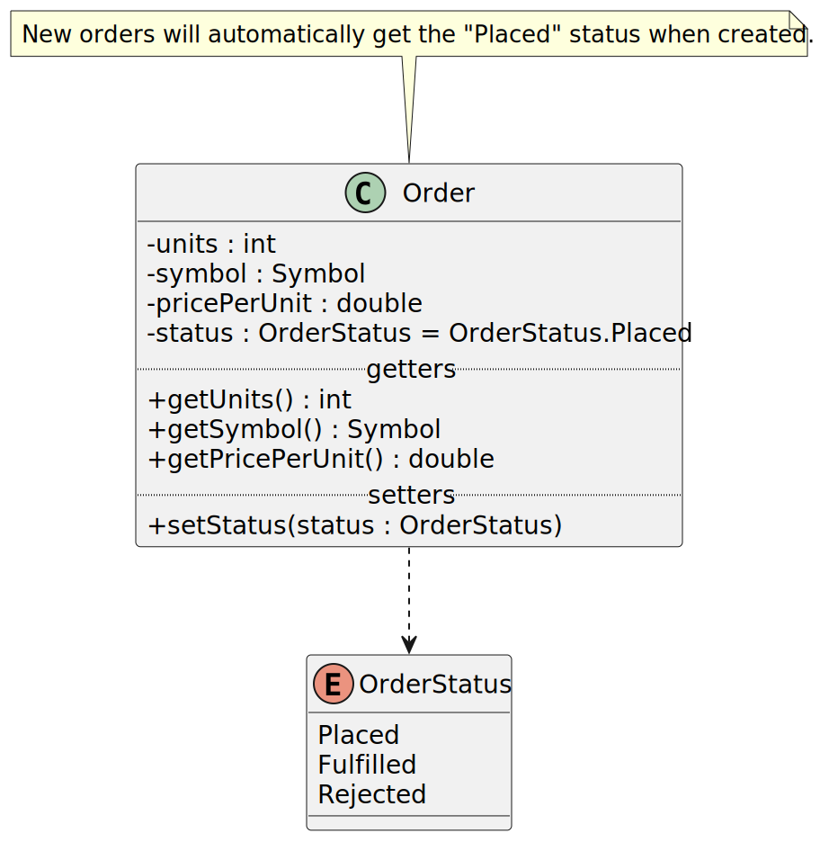
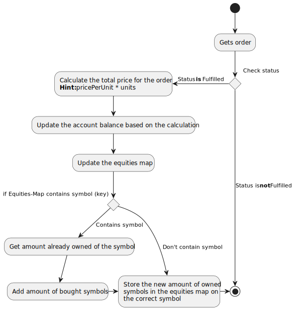
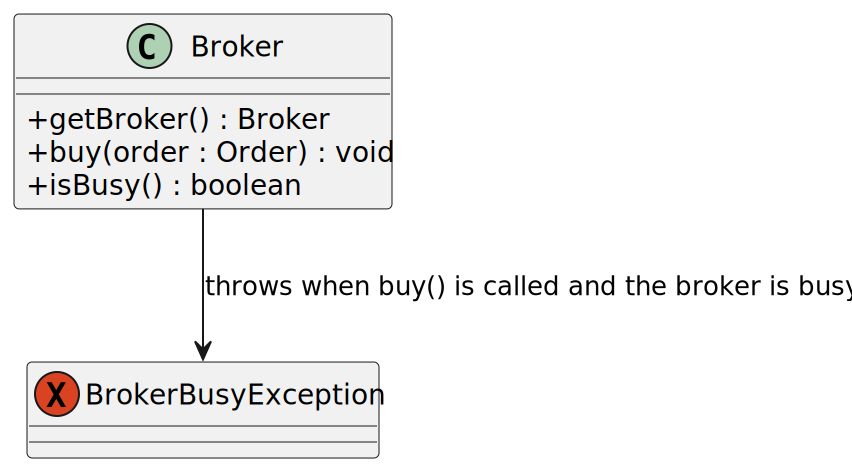
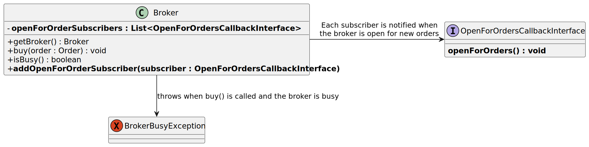
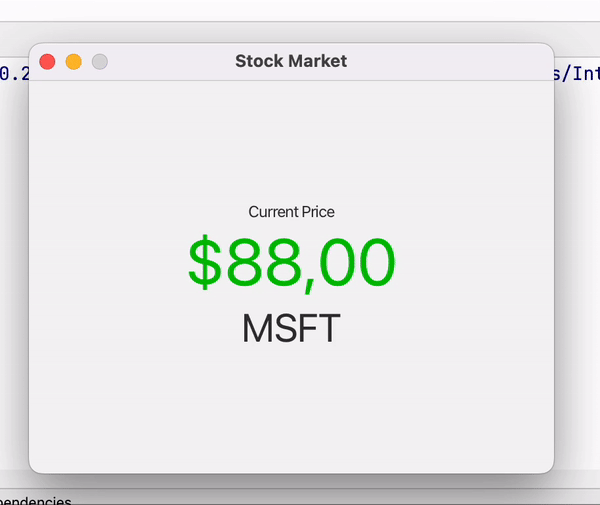
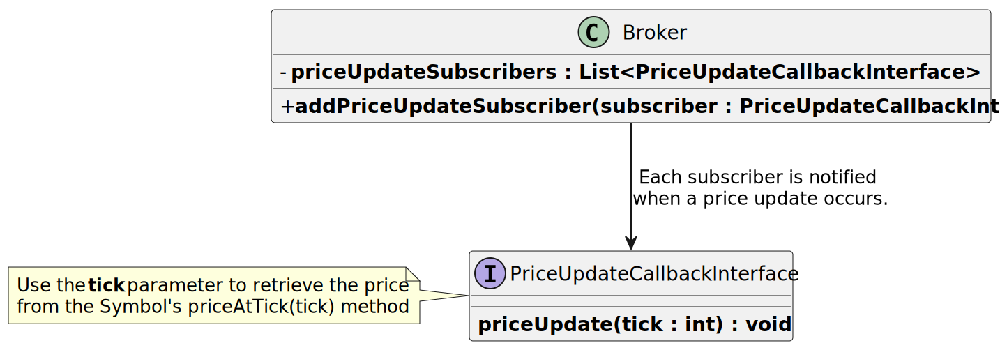

# Point-giving Activity 2

This task aims to emulate buying stock from a stock market. We'll import some symbols (Google (GOOG) and Microsoft (MSFT)), using their closing price each day over the last ~5 years. 
With this information we'll create an account that can buy stock. And lastly we'll create a small GUI in JavaFX that shows the change in price of the GOOG or MSFT stock (up to you which one). 

We'll be working with:
- File I/O
- Lists
- Threads
- Race-conditions
- Callback Interfaces
- JavaFX

We have provided a broker package that you are going to interact with, this will be explored further in task 2 and 3.

Lastly, Task 3 can be completed without the completion of task 2. As such, if you are struggling with task 2, it is advised to attempt to solve task 3.

## Task 1 - Implement the Symbol class

The `Symbol` class represents a given symbol on the stock exchange (such as MSFT and GOOG). Since we never want to create a single instance of symbol, the class is abstract -> as such we must create a class for both MSFT and GOOG inherinting from the `Symbol` class. All methods except for the `loadHistory()` method have been implemented ahead of time. 

**Take note, that when a new instance inheriting from `Symbol` is instantiated it must provide a path to a csv file containing the daily price of the symbol in question.**

You can see an example of the CSV files in the `Symbols` folder in the root of this project. Each file contains a list of stock prices over the last 5 years, starting from 2018 and ending in 2023. Note that the first row in the files are headers that indicate what the values in the columns refer to. **When reading this file, you should disregard the first row**.



Lastly, review the `priceAtTick(int tick) : double` method. Each tick represents a day, thus tick = 0 is the first (oldest) day loaded from your CSV file. As such tick 365 would be a year later and so on. This method is already implemented but understanding the logic, is paramount in task 3. 

### Task 1.1 - Create Symbols

Within the `symbols` package create two new classes that inherent from the `Symbol` class:

- `GOOG.java`
- `MSFT.java`

For each of these make a no-args constructor and call `super()` inside it passing the name of the stock and the path to the relevant CSV file in the symbols folder (use a relative path!).

### Task 1.2 - symbol.loadHistory()

The `history` attribute is the only attribute that is not currently initialized. The first step is to create a fitting `List<..>` instance and assign this instance to the `history` attribute.

Then read the file sequentially (ignoring the first line as it only contains the column definitions), line by line. For each line you should extract the `Close` (**NOT `Adj Close`**) column from the current row, and add it to the `history` list. 

Be sure to catch relevant errors while doing file i/o.

### Testing

You may test your implementation by running the:
- `symbols.GOOGTest`
- `symbols.MSFTTest`

They will validate at you are able to construct a correct list for each of the two stock symbols.

## Task 2 - Trading stock using an Account

We have created an `Account` class ahead of time, however, some method stubs are not implemented yet. The `Account` has the following three attributes:
- `name : string` - name of the account.
- `balance : double` - keeps track of the balance of the account
  - Whenever an accounts buys one or more symbols, the price should be deducted from the balance.
  - Starting balance is set to 100,000 USD.
- `equitities : Map<Symbol,Integer>` - keeps track of purchased symbols. The `Symbol` refers to the `Symbol` purchased and the `Integer` refers to the amount the account owns.
  - Thus `[<MSFT, 3>]` indicates that the account has 3 MSFT symbols. 

Below you can find the class diagram for this class for the final implementation.




### Task 2.1 - Constructor

Implement the constructor such that it:
- Assigns the `name` argument to the relevant attribute.
- Instantiates the `equities` attribute using an appropriate `Map` implementation

### Task 2.2 - updateBalance(Order order) method

The method `updateBalance(Order order)` is supposed to check whether the passed order has gone through or not, and if successful update the balance and equities on the account to reflect this. Let's inspect the `Order` class first:


We can see that the order will start with a status of `Placed` and change to `Fulfilled` if we were successful in buying the stock and `Rejected` if not.

Implement the `updateBalance(Order order)` method:

1. Start by checking if the order passed to this method is fulfilled. 
2. Calculate how much of the balance on the account should be deducted based on the order (`pricePerUnit` * `units`).
3. Update the balance based on your calculation
4. Update the `equities` map on the `Account` to reflect that we have bought the symbol in the order:
   1. Check if the map already has the symbol (key), if not create a new pair and associate it with the symbol in the order and set the amount _0_.
   2. Get the current number of units owned of that symbol on the account (if this is the first then this will be 0)
   3. Update the amount based on the order units and update the map to reflect this change

### Testing

- `AccountTest` tests that you are able to correctly update the balance of the account using the `updateBalance(..)` method.

### Task 2.3 - buy(Symbol symbol, int units)

This method is supposed to interact with the __broker__ to continuously buy stock, however the broker will only allow us to buy __5__ units at once (anything more and the order will get rejected), therefore in order to maximize profits we'll create multiple threads that can initiate multiple buy orders at the same time each buying 5 units. 

The broker accepts on average 50% of orders, you can review the status on your order by looking at the status of the `order` instance after passing it to the broker's `buy` method.

Here is a simplified class diagram of the broker, with the methods you need to use to solve this task.


Implementing the method:

1. You should start by protecting this method body from race conditions using the `synchronized` keyword on the method signature.
2. To interact with the broker, we first need to retrieve it. We can do so by calling `Broker.getBroker()` and assign it to a local variable such that we can re-use the instance later on.
3. _If_ the broker `isBusy()` call `wait()` making other threads wait. Make sure to handle potential exceptions here!
4. Create a new `Order` instance, pass the parameters from this method (`symbol` and `units`) to the constructor of the `Order` during instantiation.
5. Pass the new `order` instance to the `broker.buy(order)`. 
   1. The broker will attempt to fulfill your order and automatically update the order you passed, with a status of either `Fulfilled` or `Rejected`.
6. Pass your `order` to the `updateBalance(Order order)` method you implemented in the last step.

**Hint:** It is encouraged to call the `printBalance()` every time after updating your balance. This method prints the current balance and lists the account's owned symbols and makes it easier to keep track of what's happening.

Uncomment the contents of the main method and give it a spin. It should attempt to create 5 orders, and then **it will get stuck waiting.** This is intentional, we will fix this in the next step :)

### Task 2.4 - Notifying our threads when the broker is available

Currently, when the broker is occupied, and we call `wait()` all threads wait for the broker to be available, however, we are never doing anything to wake up the threads once the broker is ready for new orders. Fortunately, there is a fix for this: The `broker` can let us know when it's ready to accept new orders again we just have to tell it to let us know. Let's re-investigate the broker class diagram:



Notice that we can create different subscribers, and the Broker will invoke the `openForOrders()` method for each subscriber, when it's ready for new orders, as long as they conform to the methods on `OpenForOrdersCallbackInterface` interface.

Within our `Account` class implement this interface. It will require us to implement the `openForOrders()` method on the class. Mark this method as `sychronized` such that we gain access to the `wait` and `notify` methods. 

- Within this method call `notify()`. That's it !

Lastly, uncomment this line in the main method:
```java
Broker.getBroker().addOpenForOrderSubscriber(account); 
```

This will add our account as a subscriber for updates when the broker is ready to accept new orders. When the broker is ready it will call our `openForOrders()` method on the `Account` instance, that will then `notify` our waiting threads to wake up and attempt to buy more stock.

When you now run the `main` method, the method should keep running until your balance is depleted (it may take a little while)

### Testing

- `BuyStockTest` tests that you are able to purchases the GOOG stock within an acceptable timeframe until your balance is depleted. It also checks that you accumulate a fitting amount of GOOG stock. Any exceptions thrown will make this test fail.

## Task 3

In this last task, we'll attempt to recreate a UI like the one below:



We will once again interact with the broker to receive price updates. Just like the broker is able to tell us when it's no longer waiting for orders, it can also tell us when there is a price update, using the `PriceUpdateCallbackInterface` interface.

Let's have a look at the class diagram:


As we can see here, if we create an implementation of the `PriceUpdateCallbackInterface` then the broker will let us know when an update occurs passing the current tick. This tick can then be passed to a `Symbol`'s `priceAtTick(tick : int) : double` method to get the current price.


### Task 3.1 FXML
Create the appropriate labels such that you can create a GUI that shows:
- The current price
- The name of the symbol being shown

### Task 3.2 Controller

Update the controller, such that when it's initialized it:

- Retrieves the `broker` by calling `Broker.getBroker()`
- Create a new Symbol instance using either your `GOOG` or `MSFT` class.
- Implement the `PriceUpdateCallbackInterface` within this class.
  - During the implementation of the `priceUpdate` method call `priceAtTick` on the symbol you instantiated earlier and pass the current tick from the argument.
  - `priceAtTick` returns a `double` that represents the current price. This price should be shown on the GUI using one of the labels you created in the last step.
  - **HINT**: The broker runs on another thread, therefore it will be executing the code from the interface in that other thread. As such, be sure you update the GUI in a safe manner (with the use of `Platform.runLater(...)` 👀) 

When you run the `App.java`, the label should automatically update to reflect the current price.

### Task 3.3 Track last change

The last task is to show how the price has changed since the last tick. This can either be done by adding another label to the GUI showing how much the difference is between the last tick and now:
> Price up $0,5

Could be an example of this. Alternative you may also do as the example and change the color such that it indicates if the price went up and down.

You can use the following code to change the color of the text on a label
```java
[LABEL_NAME].setTextFill(Paint.valueOf("[COLOR_NAME]"));
```