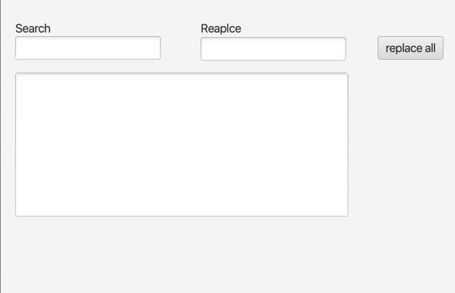
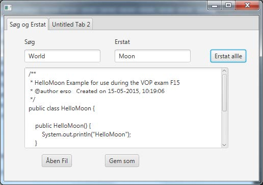

# Lesson 2: Exercise, Search And Replace

**From ordinary exam, VOP F15.**

## Task 1 - Search and Replace

You will be working with the following file(s) for this exercise: **FXMLController.java, Primary.FXML**

**Purpose:** Using JavaFX to create a GUI application with search and replace functionality.

1. Add the following components to your scene:

   - A `Label` and a `TextField` for the text you will be searching for
   - A `Label` and a `TextField` for the text you will be replacing it with.
   - A `TextArea` for showcasing the text you will be search-and-replacing in
   - A `Button` for implementing the _Replace All_ functionality.

2. Program an `actionHandler` for the button, so every occurrence of the text in the _“search”-field_ will be replaced by the text in the _“replace”-field_

Your stage should look like this at the end of Task 1

## Task 2 - Simple File-I/O

**Purpose:** To be able to load the text you wish to use the search-and-replace functionality from a file and saving the altered text in another file.

You will be working with the following file(s) for this assignment: **FXMLController.java, Primary.FXML, ”HelloWorld.txt”**

1. Create a FileChooser _instance_-variable.
2. _Initialize_ the FileChooser, in the **FXMLController’s `initialize()`**-method and set the
   `InitialDirectory` to the project folder `(new File("."))`, as follows `fileChooser.setInitialDirectory(new File("."))`
3. Add 2 buttons to your scene, _“Open file”_ and _“Save as"_.
4. Create an `ActionHandler `for the _”Open file”_-button which uses the `FileChooser`, to select the desired file as follows: `File inFile = fileChooser.showOpenDialog(null);` Read the content of the inFile and load into the `TextArea.`
5. Create an `ActionHandler `for the _“Save as”_-button, which uses the `FileChooser`, to pick an existing file, or creating a new file, as follows: `File outFile = fileChooser.showSaveDialog(null);` The content of the `TextArea,`should be written in the outFile.

Example of the final stage visible below:

In this example _”HelloWorld.txt”_ has been loaded. (found in the root of the project folder), all occurrences of the word _”World”_ has been changed to _”Moon”_ and the result has been saved to _”HelloMoon.txt”_.
